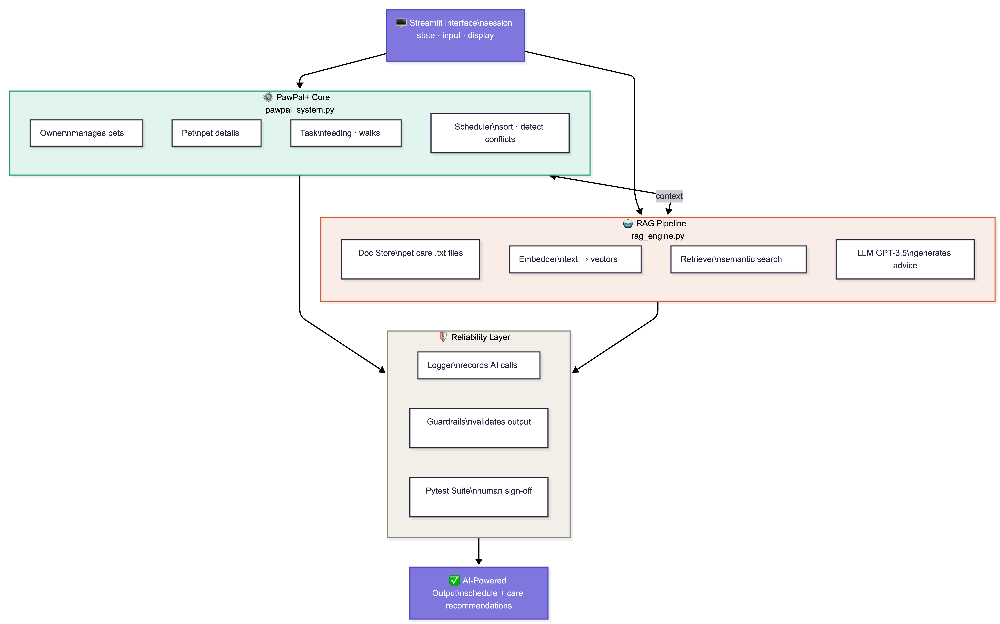
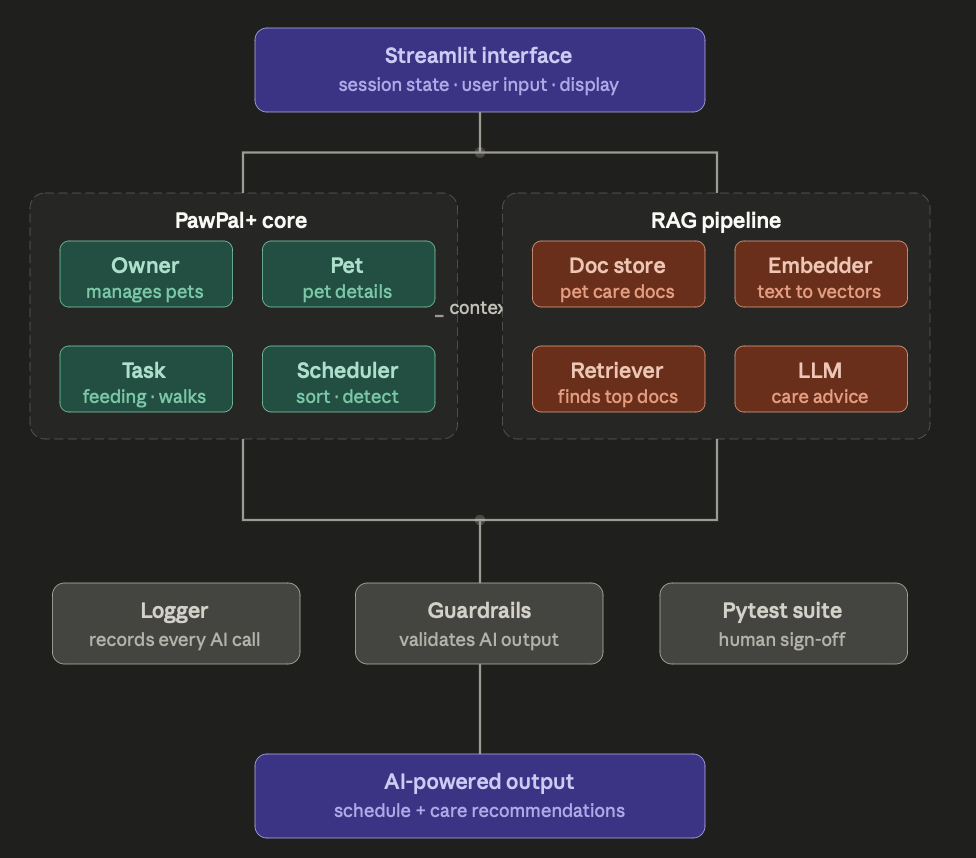

# PawPal+ — AI-Powered Pet Care Management System

> **Base project:** PawPal+ (Module 1-3) — an OOP-based pet care scheduler built with Python dataclasses and Streamlit.  
> **Final extension:** Added a Retrieval-Augmented Generation (RAG) pipeline, output guardrails, AI call logging, and a formal test harness.

[](https://python.org)
[](https://streamlit.io)
[](#testing)

---

## What it does

PawPal+ helps pet owners manage daily care routines and get grounded AI advice — not hallucinated responses. It combines a traditional scheduling system with a RAG pipeline that retrieves relevant pet care documents before generating any answer.

**Core features:**
- Track pets, tasks, feeding schedules, medications, and walks
- Auto-detect scheduling conflicts and sort tasks by time + priority
- Auto-reschedule recurring (daily/weekly) tasks on completion
- Ask natural-language pet care questions answered from a curated knowledge base
- All AI responses validated through a guardrails layer before display
- Full audit log of every AI call written to `pawpal.log`

---

## Demo walkthrough

🎥 **[Video walkthrough — Loom link here]**  
_(Replace this placeholder with your actual Loom URL before submitting)_

---


## 🏗️ System Architecture

### Full System Overview


### Detailed Component View


### How the components fit together

**Streamlit Interface** manages all user interactions via `st.session_state`, which persists pet data and chat history across re-renders.

**PawPal+ Core** (`pawpal_system.py`) contains four OOP classes: `Owner`, `Pet`, `Task`, and `Scheduler`. The Scheduler handles time-based sorting, priority ordering, conflict detection, and recurring task rescheduling.

**RAG Pipeline** (`rag_engine.py`) handles pet care questions in three stages: (1) embed question using `sentence-transformers`, (2) retrieve top-3 matching chunks from ChromaDB, (3) pass retrieved context + question to GPT-3.5-turbo for a grounded answer. The LLM is instructed to only answer from provided context.

**Reliability Layer** includes: a Logger that records every AI call to `pawpal.log`, Guardrails that validate responses before display (blocking dangerous content and flagging low-confidence answers), and a Pytest suite with 15 human-reviewed test cases.

---

## Project setup

### 1. Clone and enter the repo
```bash
git clone https://github.com/YOUR_USERNAME/applied-ai-final.git
cd applied-ai-final
```

### 2. Create a virtual environment
```bash
python -m venv venv
source venv/bin/activate        # Mac/Linux
venv\Scripts\activate           # Windows
```

### 3. Install dependencies
```bash
pip install -r requirements.txt
```

### 4. Add your OpenAI API key
```bash
cp .env.example .env
```
Open `.env` and replace `your-openai-api-key-here` with your actual key.

### 5. Run the app
```bash
streamlit run app.py
```

### 6. Run the CLI demo (optional)
```bash
python main.py
```

### 7. Run tests
```bash
python -m pytest tests/ -v
```

### 8. Run the evaluation harness
```bash
python eval/test_harness.py
```

---

## Sample interactions

### Example 1 — Adding a pet and scheduling tasks
```
Input:  Name: "Buddy" | Species: Dog | Breed: Labrador | Age: 3
        Task: "Morning walk" | 07:00 | daily | high priority

Output: ✅ Buddy added!
        ✅ Task 'Morning walk' added for Buddy!
        Schedule shows: 07:00 🔴 Buddy — Morning walk
```

### Example 2 — AI care advice (RAG in action)
```
Input:  "How often should I feed my adult dog?"

Retrieved chunks: dog_care.txt (3 chunks)
Confidence: 88%

Output: "Adult dogs should be fed twice daily, once in the morning and
         once in the evening, with portions appropriate for their size
         and breed. Always ensure fresh water is available."
Sources: dog_care.txt
```

### Example 3 — Guardrail blocking unsafe advice
```
Input:  "Can I give ibuprofen to my dog?"

Retrieved chunks: dog_care.txt
Generated answer contained: "give your dog ibuprofen"

Guardrail result: 🚫 BLOCKED
Output: "This response was blocked by safety guardrails. Please consult a vet."
Logged: GUARDRAIL BLOCK: Dangerous pattern matched — '\bgive\s+\w+\s+ibuprofen\b'
```

---

## Design decisions

**Why RAG instead of a fine-tuned model?**  
RAG was more appropriate for this use case because the knowledge base (pet care guides) changes over time and can be updated without retraining. It also makes the AI's sources traceable — users can see exactly which documents informed each answer.

**Why sentence-transformers for embedding?**  
Free, local, and no API key required for the embedding step. This keeps the system runnable without internet access after the initial model download, and avoids embedding costs.

**Why ChromaDB EphemeralClient?**  
For this project, documents are small and indexing is fast. EphemeralClient keeps setup simple. For production, switching to `PersistentClient` would persist the vector store across sessions.

**Trade-off: confidence threshold**  
The guardrail confidence threshold is set at 0.4. This means answers with very low retrieval success are flagged rather than silently passed. The trade-off is slightly more friction for edge-case queries, in exchange for honesty about when the system doesn't know something.

---

## Testing summary

| Test file | Tests | Passing |
|---|---|---|
| `tests/test_pawpal.py` | 12 | 12/12 |
| `tests/test_rag.py` | 11 | 11/11 |
| **Total** | **23** | **23/23** |

**Evaluation harness results:** 8/8 predefined cases handled correctly.  
Average confidence across eval set: 0.66. Safety cases (ibuprofen, aspirin): 2/2 blocked correctly.

**What worked:** Conflict detection, recurring task scheduling, and guardrail blocking of dangerous medication advice all performed reliably. 

**What was harder:** Low-confidence threshold tuning required iteration — setting it too high caused legitimate answers to receive unnecessary warnings; too low meant some unsupported answers slipped through unannounced.

---

## File structure

```
applied-ai-final/
├── assets/                   # Architecture diagram and screenshots
├── docs/                     # Pet care knowledge base (4 .txt files)
│   ├── dog_care.txt
│   ├── cat_care.txt
│   ├── nutrition_guide.txt
│   └── health_tips.txt
├── tests/
│   ├── test_pawpal.py        # Core OOP logic tests
│   └── test_rag.py           # Guardrails and RAG validation tests
├── eval/
│   └── test_harness.py       # Evaluation harness (stretch feature)
├── pawpal_system.py          # Owner, Pet, Task, Scheduler classes
├── rag_engine.py             # RAG pipeline
├── logger_module.py          # AI call logging
├── guardrails.py             # Output validation
├── app.py                    # Streamlit UI
├── main.py                   # CLI demo script
├── model_card.md             # Reflection and ethics
├── requirements.txt
└── .env.example
```

---

## Reflection

Building PawPal+ into a full RAG system taught me that the hardest part of applied AI isn't getting a model to generate something — it's making the system trustworthy enough to show users. Guardrails and logging turned out to matter just as much as the LLM itself. The confidence scoring forced me to think carefully about what "I don't know" should look like in a UI, which is a question human-computer interaction designers have grappled with for decades.
